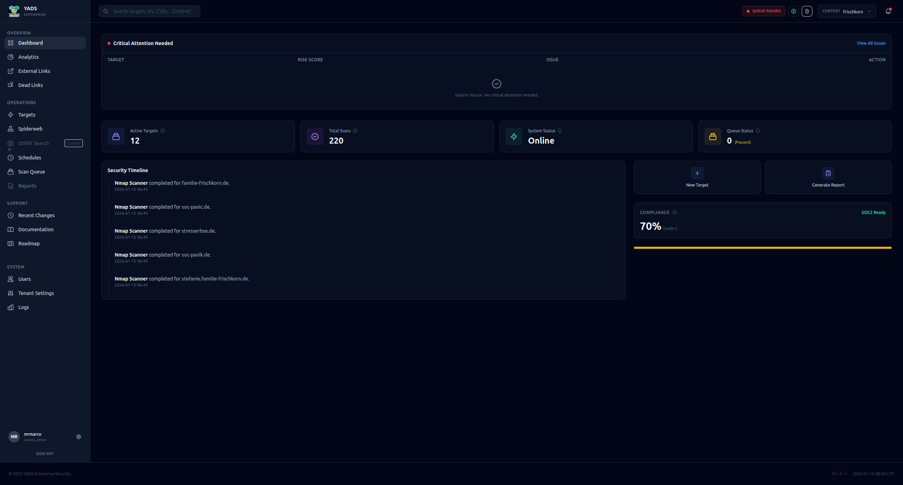
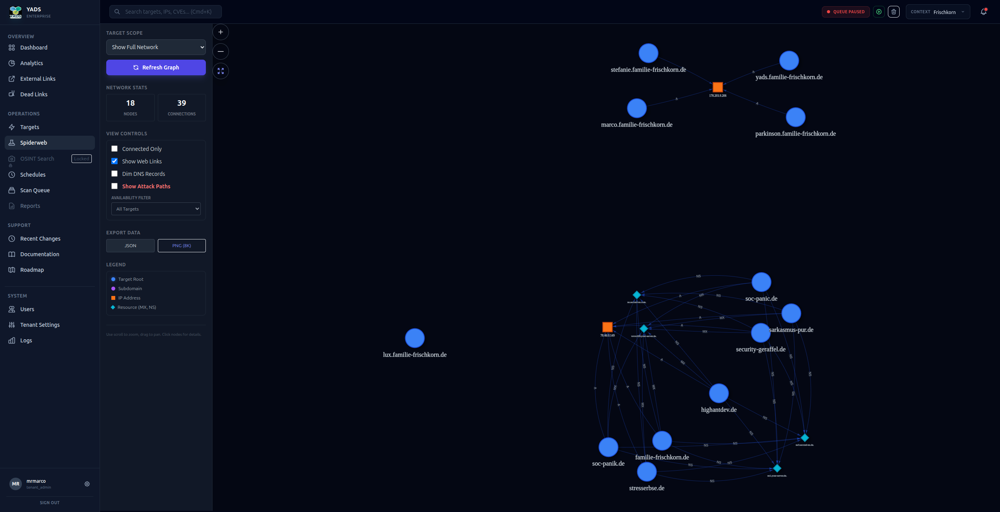
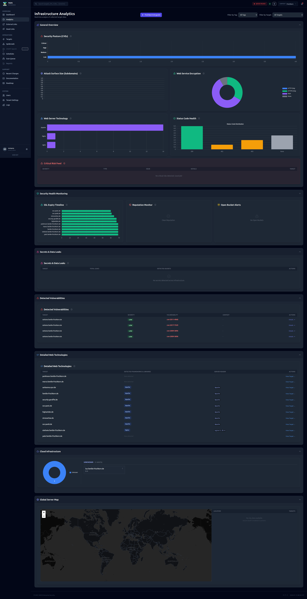
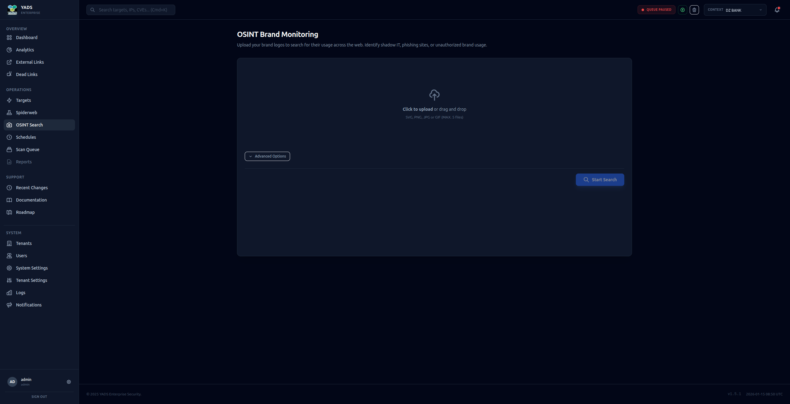
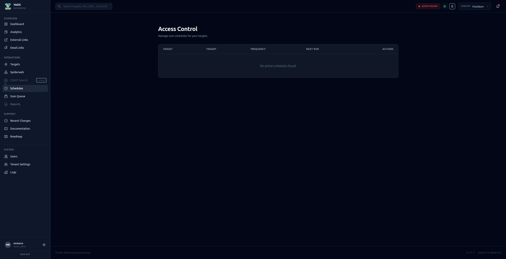

# 🚀 YADS - Yet Another DAST Solution

**Sicherheit, die man sehen kann.**

> **Status:** v1.5.0 Live
> **Lizenz:** Open Source

Schluss mit unübersichtlichen Tabellen. YADS ist die moderne Reconnaissance-Platform für Teams, die ihre Attack Surface verstehen, analysieren und absichern wollen. Modular. Skalierbar. Open Source.

---

## 🎯 Mehr als nur ein Port-Scanner

YADS aggregiert Daten aus verschiedensten Quellen zu einem **Single Pane of Glass**. Es wurde entwickelt, um die Lücke zwischen manueller Penetration-Testing-Recherche und vollautomatisiertem Vulnerability Management zu schließen. Vom ersten DNS-Request bis zum fertigen Management-Report – alles in einer UI.

---

## 🛡️ Die Scanning Engine

Unter der Haube arbeitet ein leistungsstarkes, modulares Framework.

### 1. CORE Reconnaissance
Die Basis jeder Sicherheitsanalyse. YADS findet, was Sie vergessen haben.
*   **Subdomain Enumeration:** Passive (CT Logs) & aktive Brute-Force Methoden.
*   **DNS Analyse:** A, AAAA, MX, TXT, NS Records und Zone Transfers.
*   **Port Scanning:** TCP/UDP Scans.

### 2. WEB Web Analyzer
Simuliert einen echten User-Besuch mit einem Headless-Browser.
*   **Tech Stack Detection:** Erkennt CMS, Frameworks (React, Vue), Webserver.
*   **Screenshot Engine:** Automatische Full-Page Screenshots.
*   **Header Analyse:** Prüft Security Headers (HSTS, CSP).
*   **API Discovery:** Findet Swagger/OpenAPI Specs und GraphQL Endpunkte.

### 3. Vulnerability & DAST (NEU)
*   **Nuclei Integration:** Template-basiertes Scannen auf 5000+ CVEs.
*   **JS SAST:** Statische Analyse von Client-Side JavaScript auf Secrets.
*   **Stealth Mode:** Langsame Scans zur Umgehung von WAFs.

---

## 🕸️ Visualisierung & Netzwerk Graph

In großen Infrastrukturen verliert man schnell den Überblick. Der Network Graph macht Zusammenhänge sofort sichtbar via **Force-Directed Graph**.

*   **Relationship Mapping:** Sehen Sie, welche Domains auf derselben IP hosten.
*   **Proaktives Clustering:** Erkennen Sie Schatten-IT Cluster sofort.
*   **Filter:** Blenden Sie DNS-Layer aus, um sich auf Web-Verbindungen zu konzentrieren.

---

## 📊 Analytics & Insights

Daten sind gut, Verständnis ist besser.

### Geo- & Tech-Intelligence
Wo stehen Ihre Server physikalisch? Welche Länder hosten Ihre kritischen Daten? Welche Webserver-Versionen dominieren Ihr Netzwerk?

### Dead Links & Hijacking
Finden Sie "tote" Links in Ihren Anwendungen. YADS identifiziert zudem **Dangling DNS Records**, die auf nicht mehr existente Cloud-Ressourcen zeigen.

---

## 🕵️ OSINT Brand Monitoring

Ihre Marke endet nicht auf Ihren eigenen Servern. YADS nutzt die **Google Cloud Vision API**, um das Internet nach visuellen Kopien Ihrer Logos und Assets zu durchsuchen.

*   **Phishing Detection:** Findet betrügerische Seiten, die Ihr Design kopieren.
*   **Schatten-Marketing:** Entdecken Sie alte Landingpages.

---

## 📑 Reporting & Management

*   **Multi-Tenancy:** Trennen Sie Daten strikt nach Mandanten (Kunden/Abteilungen).
*   **Scheduling:** "Set and Forget". Definieren Sie Scan-Intervalle.
*   **Export:** PDF Management Summaries und Excel/CSV Raw Data Export.

---

&copy; 2026 YADS Security Project.
