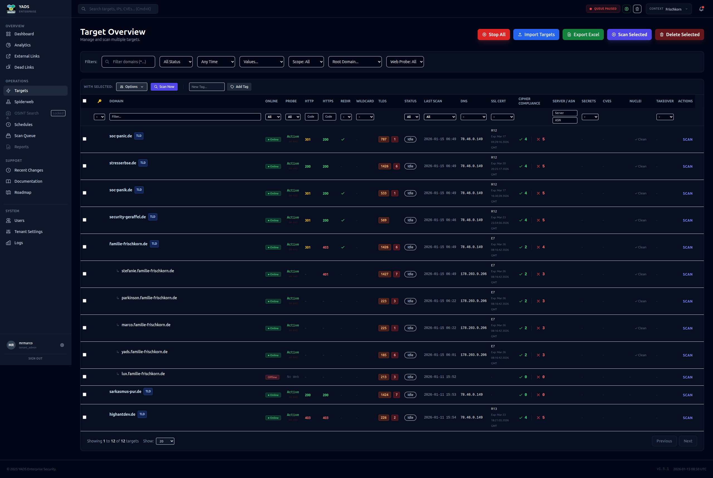
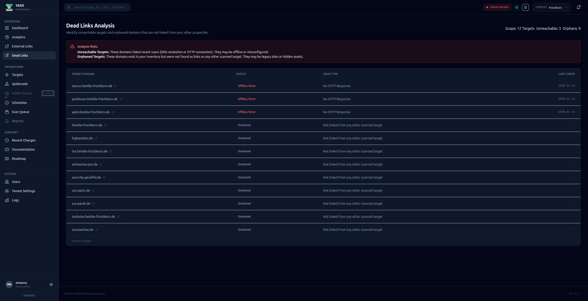
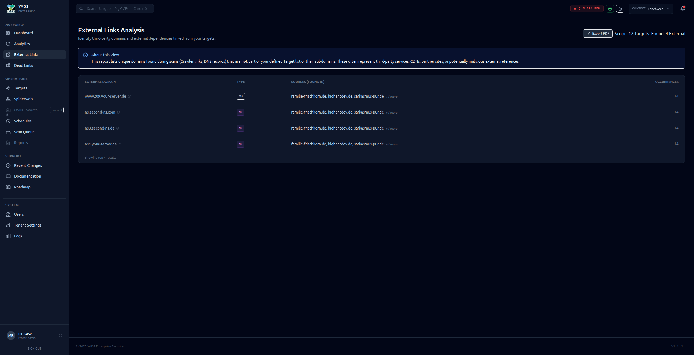
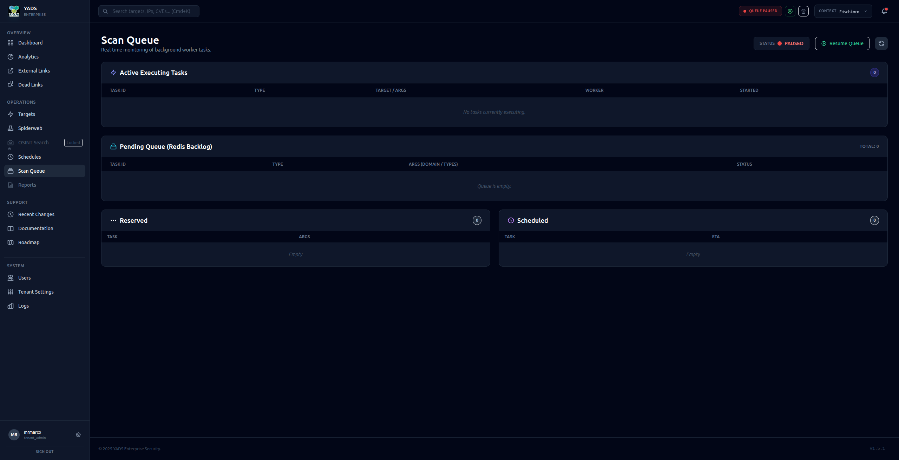
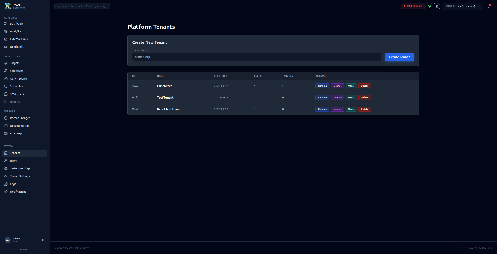
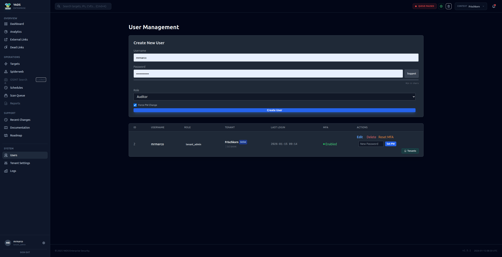
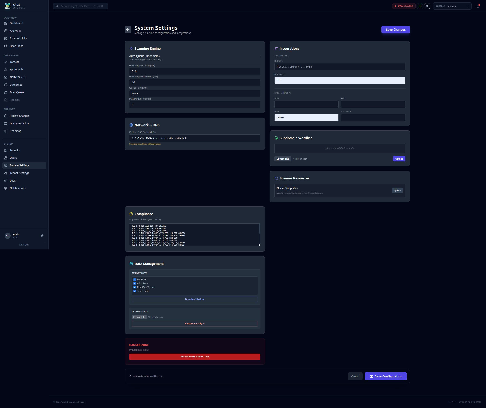
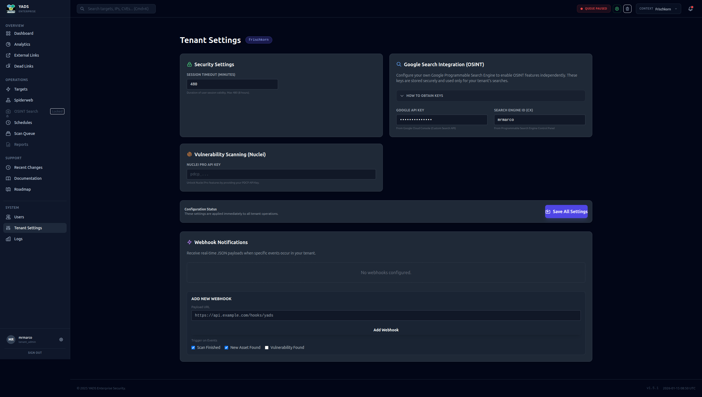

# YADS - Yet Another DAST Solution

**The Comprehensive Platform for Automated Vulnerability Scanning and Asset Management.**

YADS is a powerful security solution designed to monitor, analyze, and protect your digital infrastructure. With an intuitive user interface and robust backend capabilities, YADS empowers security teams to efficiently identify and remediate vulnerabilities.

---

## 🚀 Dashboard & Overview
The Dashboard provides an instant overview of the security status of your monitored assets. See active scans, critical vulnerabilities, and key statistics at a glance.

---

## 🕸️ Network Visualization
Understand the relationships within your infrastructure with our interactive Network Graph. Identify dependencies, visualize connections between hosts, and visually detect potential attack paths.

*Features:*
- Interactive nodes and edges
- Filter by connection types
- Export functions

---

## 🎯 Target Management
Manage all your targets in one place. Add new hosts, categorize assets, and keep track of the scan status of each individual endpoint.

---

## 📊 Analytics & Reporting
YADS provides deep insights into your security data.

### General Analytics
Detailed evaluations of scans and results help you recognize trends.

### Dead Links Analysis
Identify dead links that could pose a security risk or negatively affect user experience.

### External Links
Monitor which external resources your applications are linking to.

---

## 📅 Scheduling & Automation
Automate your security scans. Schedule regular checks (daily, weekly) to ensure your infrastructure is continuously monitored without requiring manual intervention.

---

## ⏳ Queue Management
Keep control of running and pending tasks. The Queue Manager shows you exactly which scans are currently executing and what is queued next.

---

## 🕵️ OSINT - Open Source Intelligence
Utilize integrated OSINT tools to gather publicly available information about your targets and identify potential information leaks.

---

## 👥 Multi-Tenancy & User Management
YADS is built for teams and organizations of any size.

### Tenants
Logical separation of data and resources through multi-tenancy.

### Users
Manage access rights and user accounts centrally.

---

## ⚙️ Settings & Configuration
Customize YADS to your specific needs.

### Global Settings
Configure system-wide parameters.

### Tenant Settings
Specific configurations per tenant.

---

**YADS - Your Security in Focus.**
